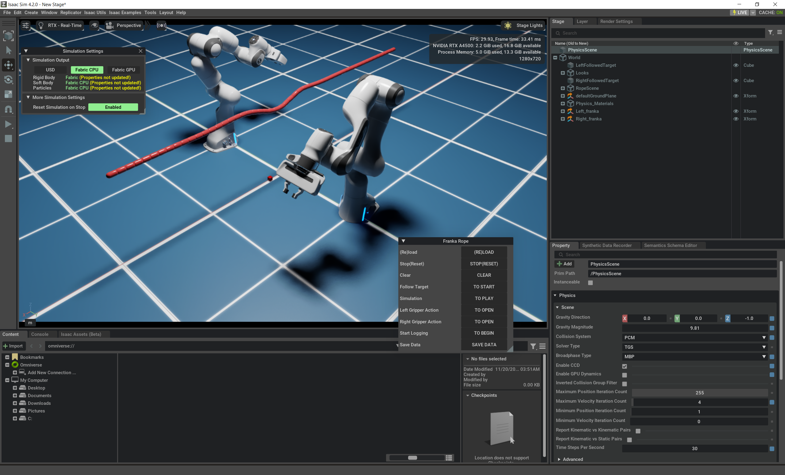
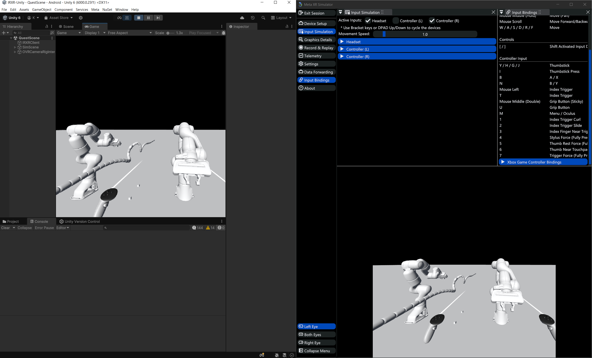

# requirements
- isaac sim installed from omniverse app/launcher
- optional installation: 
    - omniverse cache for performance
    - for meta quest 3: install
        - "omni.physx.fabric" (omniverse/isaacsim) extension, currently required by isaacSimPublisher
            - the code should enable this ext automatically
        - unity w/ Meta XR All-in-One SDK
        - extra: meta xr simulator(unity) for running on PC
        - https://github.com/intuitive-robots/IRXR-Unity/tree/meta-quest3-dev to run on meta quest
        - and https://github.com/intuitive-robots/SimPublisher/tree/isaacsim to communicate with meta quest over tcp protocol
            - install simpublisher (as editable)
                ```
                cd OMNIVERSE_ISAACSIM_PATH
                python -m pip install -e "PATH_TO\SimPublisher"
                ```

# setup
1. unzip into a folder
2. create softlink: `ln -s "PATH_TO_UNZIPPED_FOLDER" "PATH_TO_ISAAC_SIM\exts\omni.isaac.examples\omni\isaac\examples\user_examples\franka_rope"`
3. add `from .franka_rope import *` to `PATH_TO_ISAAC_SIM\exts\omni.isaac.examples\omni\isaac\examples\user_examples\__init__.py`
4. profit! `isaac-sim.bat` or no-gui: `isaac-sim.headless.native.bat` (`./isaac-sim.sh --headless_mode native`)
    
    
    

25-35 fps on vm: epyc 7543p w/ 4cores 8 threads slice, 28gb mem, rtx a4500 w/ 20gb vram, win 10
- physx.nonrender simulation/computation is the bottleneck: ~40ms per delta time

# code overview
- `class FrankaRope(BaseSample):` handles core logic and isolated events including simulation
    - BaseSample is stateful and provides life cycle management
- `class ControlFlow:` handles basic platform agnostic basic control logic
- `class IsaacUIUtils(ControlFlow):` and `class VRUIUtils(ControlFlow):` are for complex interdependent button events/states
- `class RigidBodyRope:` is based on the reference implementation `PATH_TO_ISAAC_SIM\extsphysics\omni.physx.demos\omni\physxdemos\scenes\RigidBodyRopesDemo.py`
    - it does not use the `pointinstancer` since 
        - `isaacsimpublisher` currently rely on the `fabric` backend
        - and current implementation of `fabric` (v106.1.9) backend had runtime issue with `pointinstancer`
        > Point instancer rigid bodies are now not updated through fabric extension. Runtime changes to the scene composition might not be correctly reflected in fabric and maybe lead into issues.
- `class FollowTarget`: slightly modified to add some input params + override position and velocity iteration counts per step for franka

## vr buttons
- press X to re-init the stage including the shape of the rope
- press Y to start and stop/save the following and recording task
    - re-init the stage without stop the task first will **discard** current recording
- holding A to recalibrate the pose of the vr controller w/o updating to the gripper
- press B to pause/unpause the simulation
- press left/right index trigger to open/close the parallel gripper

# fix
xr simulator will only launch once, unless it was destroyed properly:
- follow https://communityforums.atmeta.com/t5/Unity-Development/Meta-XR-Simulator-starts-only-once/td-p/1141806 to add life cycle management to `Assets\SceneLoader\Scripts\RigidObjectsController.cs` in `IRXR-Unity`

---

weird **bugs** in isaac sim/omniverse
- clean cache and/or data using: bat or sh: `isaac-sim.bat --clear-data --clear-cache`
    - **WARNING: ISAACSIM WILL RESET TO DEFAULT, DATA/CACHE WILL BE LOST**
- for reproducibility: test the code after cleaning the cache + data

# misc
## install isaac-sim on a remote (linux) workstation
:: login and local port forwarding
`ssh USERNAME@HOSTIP -L 8211:localhost:8211 -L 49100:localhost:49100`

:: install micromamba / conda first
`conda install conda-forge::apptainer`

:: check the newest version: https://catalog.ngc.nvidia.com/orgs/nvidia/containers/isaac-sim/tags
`apptainer build isaac-sim.sif docker://nvcr.io/nvidia/isaac-sim:4.2.0`

`export APPTAINERENV_ACCEPT_EULA="Y"`
`apptainer exec --nv isaac-sim.sif bash`
`/isaac-sim/isaac-sim.headless.webrtc.sh`

:: now open browser on the local machine
:: dont use localhost: kit-player.js has issue with http://localhost, it sometimes treats it as a secured connection and demands a token
:: to test the connection: `curl -I URL`
:: the default resolution is 720p, to change it follow this instruction: https://forums.developer.nvidia.com/t/changing-the-display-resolution-of-the-webrtc-streaming-in-isaac-sim-2023-1-0/270110/13


`http://127.0.0.1:8211/streaming/webrtc-demo/?server=127.0.0.1`

---

:: alternatively to use native steaming client
`/isaac-sim/isaac-sim.headless.native.sh`

:: install omniverse streaming client from omniverse launcher
use the `HOSTIP` to start streaming
