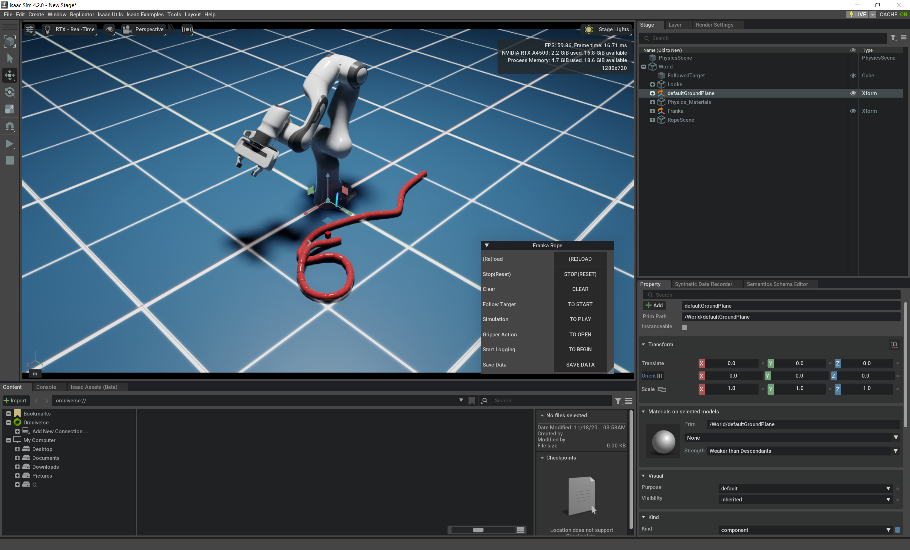

# requirements
- isaac sim installed from omniverse app
- optional installation: 
    - omniverse cache for performance
    - for meta quest 3: install
        - "omni.physx.fabric" (omniverse/isaacsim) extension, currently required by isaacSimPublisher
        - unity w/ Meta XR All-in-One SDK
        - extra: meta xr simulator(unity) for running on PC
        - https://github.com/intuitive-robots/IRXR-Unity/tree/meta-quest3-dev to run on meta quest
        - and https://github.com/intuitive-robots/SimPublisher/tree/isaacsim to communicate with meta quest over tcp protocol

# setup
1. unzip into a folder
2. create softlink: `ln -s "PATH_TO_UNZIPPED_FOLDER" "PATH_TO_ISAAC_SIM\exts\omni.isaac.examples\omni\isaac\examples\user_examples\franka_rope"`
3. add `from .franka_rope import * \n IsaacUIUtils.setUp()` to `PATH_TO_ISAAC_SIM\exts\omni.isaac.examples\omni\isaac\examples\user_examples\__init__.py`
4. profit! 

# fix
xr simulator will only launch once, unless it was destroyed properly:
- follow https://communityforums.atmeta.com/t5/Unity-Development/Meta-XR-Simulator-starts-only-once/td-p/1141806 to add life cycle management to `Assets\SceneLoader\Scripts\RigidObjectsController.cs` in `IRXR-Unity`